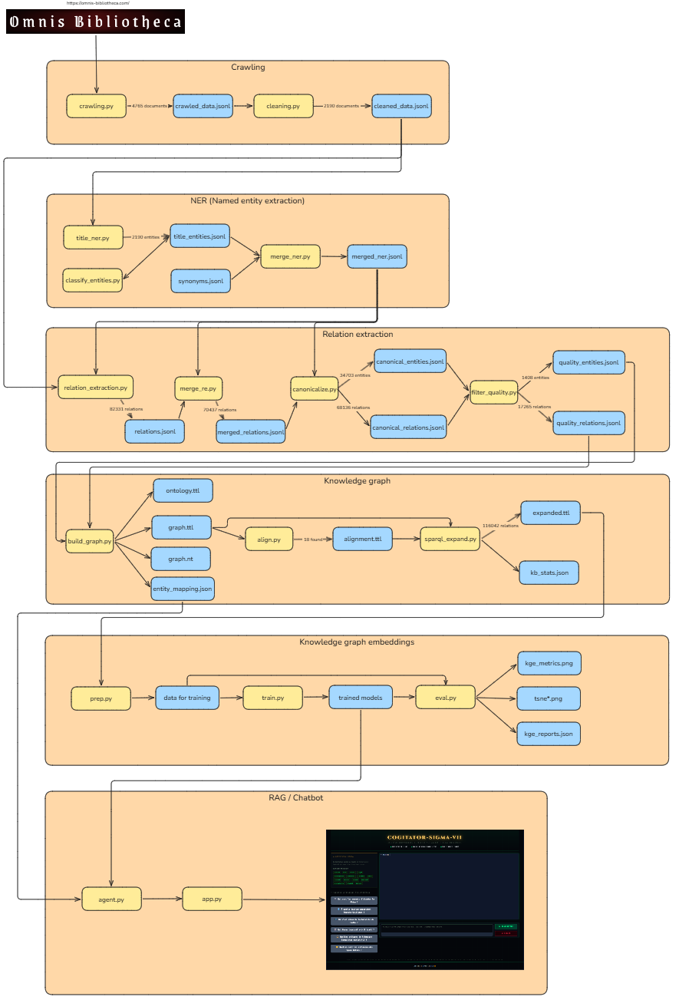
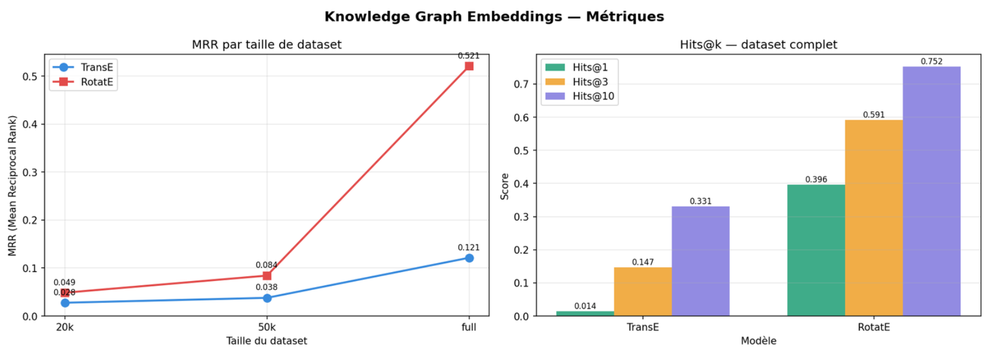
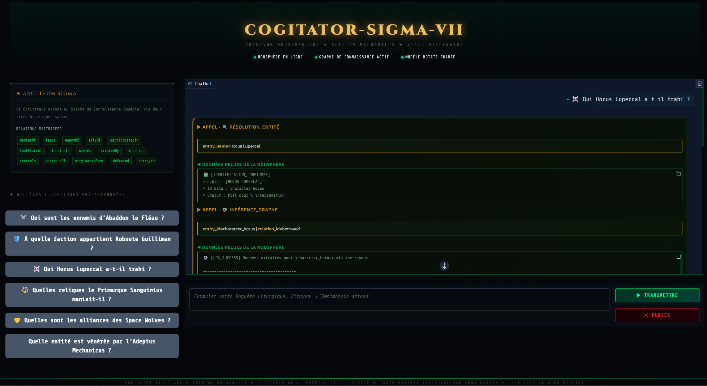

# About
This goal of this project is to build a WarHammer40k Chatbot, using graph rag to retrieve context.
The project covers the full pipeline from crawling the data source (Omnis Bibliotheca) to deploying the UI of the chatbot.

**Owners:** Samuel Carel, Ronan Bouzat

# Installation

1) **Open your terminal (or open the project in VSCode), and navigate to the root of the project**

2) **Create a virtual environment:** `python -m venv wh40k_env`

3) **Activate the virtual environment:**
    - Windows (CMD): `wh40k_env\Scripts\activate`
    - Windows (Power Shell): `wh40k_env\Scripts\Activate.ps1`
    - Linux / MacOS: source `wh40k_env/bin/activate`

4) **Install the required packages:** `pip install -r requirements.txt`

# Configuration

Due to hardware limitations, we are not using local LLMs for this project.
Instead, we are calling external LLMs through a free API.
The LLMs used in this project are provided by DataBricks (Free tier).

In the `config.py` file is located the configuration (host + PAT) to call LLMs from databricks, you can reuse the ones we provide or use your own Databricks credentials.

# How to run the pipeline ?

The full pipeline takes about ~24 hours to complete.

Here are all the scripts to execute in order to complete the pipeline:
1) crawl/crawling: **~1h**
2) crawl/cleaning: ~5min
3) ner/title_ner: instant
4) ner/classify_entities: ~30min
5) ner/merge_ner: instant
6) re/relation_extraction: **~22h**
7) re/merge_re: instant
8) re/canonicalize: instant
9) re/filter_quality: instant
10) kg/build_graph: instant
11) kg/align: **30~60min**
12) kg/sparql_expand: ~5min
13) kge/prep: instant
14) kge/train: **~1-2h (depending on hardware cpu/cuda)**
15) kge/eval: instant
16) rag/eval: ~1min
17) rag/app: ~30s

Execute the scripts in the order given above.
Run each script with the following command: `python -m src.<module_name>.<script_name>` (For example: `python -m src.crawl.crawling`)

# How to run the demo ?

## Preparations

In order to run the app, you must either:
- Execute the full pipeline
- Or copy and past the files that have been prepared (those files come from the full execution of the pipeline)

**Download link: https://drive.google.com/drive/folders/1Ub57HhFefgMWyTVzkgyG8oROfPSoJmqm?usp=sharing**

The files required are:
- The completed `data` folder
- The completed `kg_artifacts` folder
- The completed `models` folder

Warning: You cannot do an hybrid execution (executing some of the scripts AND copying some of the files). All the files/models depends on each other, so mixing pipelines result together will break the trained models.
The creation of the graph is **not deterministic**, so the model trained on one graph cannot be used to infer on another.
=> **What we recommend:** First execute some of the scripts of the pipeline to verify that the project is functional and reproducible, and then (since you will most likely run the scripts that takes 22h of runtime) copy the prepared files to overwrite the results of your tests.

## Running

Simply execute the command: `python -m src.rag.app`
The results should show: `* Running on local URL:  http://127.0.0.1:7860` => Follow this URL to access the UI.

# Hardware requirements

We recommend Windows 10 or 11.

CUDA (cudnn) will accelerate the training speed, but is not mandatory.

# Screenshots

### Pipeline schema

### Embedding results

### User interface
